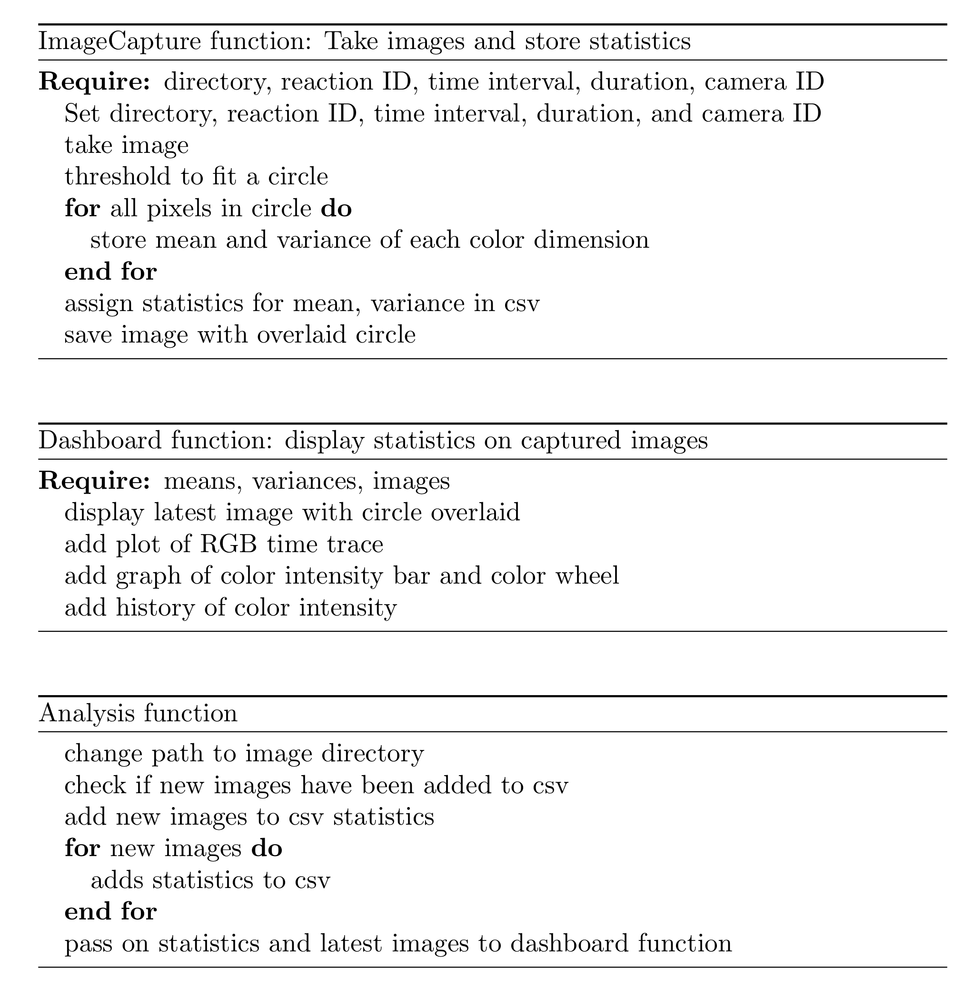

# Project AutoVis: Automatic Visualization via Webcam

AutoVis is a tool for automating visualization of colored reactions.

## Usage

Two computers are needed, one for running the experiment (i.e. taking images using a built-in camera or an external webcam) and one for running the communication manager that detects the accumulation of image data and initiates the data analysis.

### Computer 1: For taking images on the webcam, execute:

`$ python MainExperiment.py`

The user will input the path to the Dropbox directory, reaction ID, duration of webcam, and image-taking frequency. 

### Computer 2: For initiating the communication manager, execute:

`$ python MainAnalysis.py`

The user will input the path to the Dropbox directory and reaction ID.

### Dependencies and Versions Used
- python 3.5
- opencv-python
- numpy
- matplotlib
- seaborn

### Authors

AutoVis was written by Physical Sciences 50 (Spring 2018) at Harvard University. 
